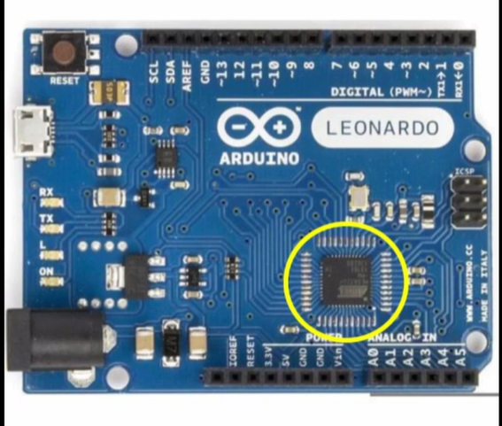
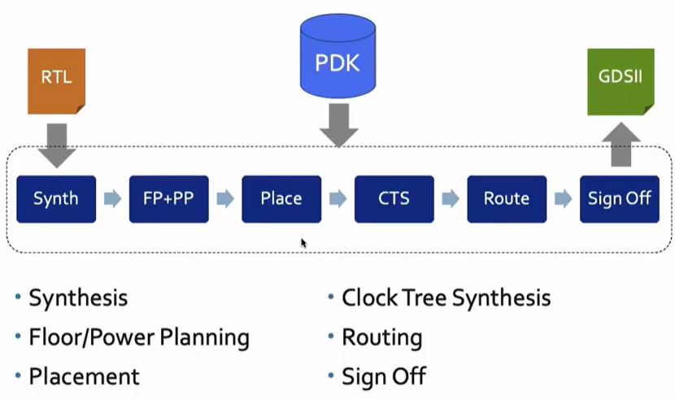
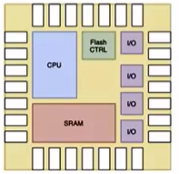
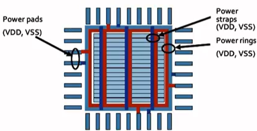
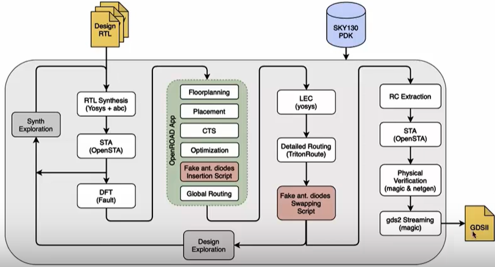
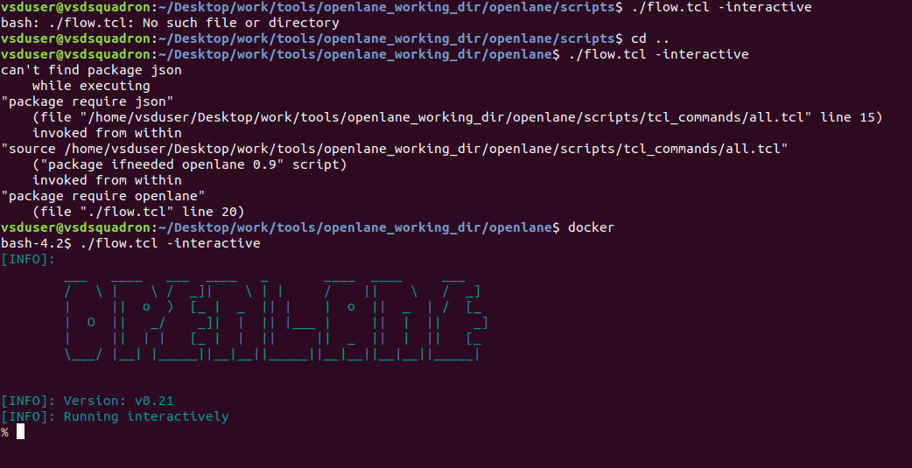
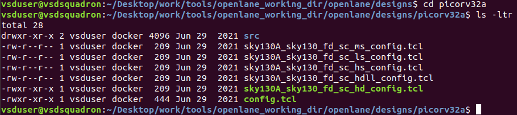
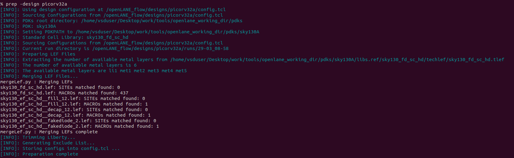
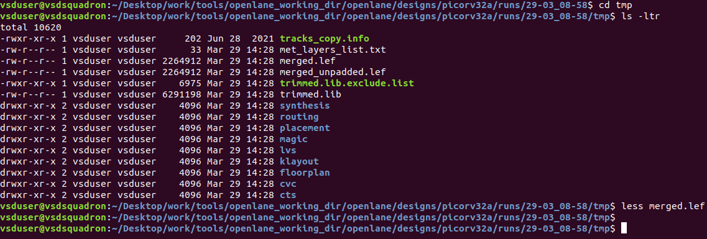
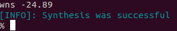

#  Day 1


# Inception of open-source EDA, OpenLANE and Sky130 PDK 
---
## Table of Content :
 * [1.Arduino Board](#1.-Arduino-Board)


## 1. Arduino Board
       
 +  

 - This is an arduino microcontroller board. The encircled area shows the chip(microprocessor) which is interfaced with other components of the board. The designing of this chip from abstract level all the way down to the fabrication is done by RTL to GDSll flow. 

## 2. Block diagram of a SoC(System on Chip)

  +      
     
This is the basic block diagram of the processor or SoC. It gives us an abstract idea of the different components present in a chip.
It consists of the main processor , SDRAM chip(memory) , ADC (analog to digital converters) , GPIOs(general purpose Input Output registers), communicatioin protocols(like I2C,UART ) etc.

###  Chip is connected to the package with the help of bond wires:
  + 

## 3. How does a chip look like?
+ 
+ 

 - **Parts of a chip**:
     - **PADS** : The blue squares around the edge are called PADS. These docks have connection points that allow the chip to send and receive messages with the outside world. These pads are connected to the pins of package  chip via bond wires.

     - **CORE** :The center black area is the brain of the chip, known as the CORE. The various components in this core work together to perform all the tasks the chip is designed for. 

     - **IP** : Each IP(Intellectual Property) block has a specific function. Chip designers can take these pre-made blocks and snap them together to build the exact functionality they need for their chip. ex: ADC, DAC, PLL, etc.

     - **Macro** : These blocks are blocks which are pure digital logic.

## 4. What is a PDK?
   - PDK stands for Process Design Kit.
   - It is nothing but a collection of files which will be used for modelling the fabrication process for IC design.
   - It includes:
        + Process Design Rules : DRC , LVS , etc.
        + Digital standard cell libraries
        + Input Output libraries
        + and many more files
    
    
 ## 5. Simple RTL to GDSll flow
 +  <br>

<u>**Step 1. Synthesis**</u> : This step converts a RTL design to a circuit by using . elements from a Standard Cell Library. The resultant circuit is called the Gate Level Netlist. Standard Cells have regular layouts and each Standard Cell has different views/models (like Electrical, HDL, SPICE)

<u>**Step 2. Floor/Power Planning**</u> : In this step our aim is to create a plan area dimensions for different components in a chip and create a robust power distributuion network for chip components.
  +    <br>
 In power planning, the chip is powered by multiple VDD and ground pins. The supply and ground pins are connected to all components using power straps and power rings. 

<u>**Step 3. Placement**</u> : We need to place the cells of netlist on the sites. Placement must be such that the interconnect delay is minimum and to be able to get efficient routing. 

<u>**Step 4. Clock Tree Synthesis**</u> : We need to create a clock distribution network which delivers clock to all the sequential elements in the circuit.
 The clock must have minimum skew.

<u>**Step 5. Routing** </u> : This step involves implementing interconnects to connect various components in the circuit. There are a fixed number of metal layers on a wafer, so we need to develop vertical and horizontal patterns to route the interconnects through these metal layers. The metal layer specs are defined in the PDK. 
+ The routing grid is formed by meta tracks.
+ We use divide and conquer approach to implement it:
  + Global routing is used to generate routing guides.
  + Detailed routing is the used to implement the actual wiring.   
  + 

<u> **Step 6. Sign Off** </u> : 
+ Physical Verifications :
  + DRC(Design Rules Checking) makes sure that the final layout follows all the design rules.
  + LVS (Layout vs Schematic) is done to check whether the generated final layout performs similar function as the initial netlist that we started with.
+ Timing Verification :
   + STA(Static Timing Analysis) makes sure that all the timing constraints are met.


## 6. Introduction to Openlane:
  - OpenLane integrates various open-source EDA tools under one roof.
  - It is tuned for PDKs of SkyWater 130nm , XFab180 and GF130G.
  - It can be used to genarate GDSll layout of macros and chips.
  - Can be operated in 2 modes :
        - Autonomous : We directly get the GDSll file.
        - Interactive : We can do all the steps individually and do experimentation and look at the results at output of each stage.
  - It has a feature called Design flow exploration which helps us to find the best set of flow configurations.
  - Openlane ASIC flow:
      +     
        - i) RTL Synthesis Using yosis and abc:
             - yosis is fed with RTL design along with design constraints and it generates the logic circuit using generic cells.
             - abc maps the circuit and then generates the optimized circuit using standard cell library.
             -abc needs to be guided using abc scripts which are there in OPENLANE refered to as synthesis strategies.
             - different strategies are present for area or power etc which may be used for different applications. 
        - ii) Synthesis Exploration Utility:
           - Shows how the delay and area of a design is affected for a particular strategy. We can select the best strategy based on this.
           - Can be used for openlane regression testing which shows the runtime, cell counts and the timing violations in design.
        - iii) DFT(Design For Test) :
            - Uses an open source App known as "Fault".
            - Performs:
             - Scan Insertion
             - ATPG(Automatic Test Pattern Generation)
             - Test Pattern Compaction 
             - Fault coverage and Fault Simulation
        - iv) Physical Implementation:
           - Uses an open source App known as "OpenROAD".
           - Performs:
             - Floor/Power Planning
             - Insertion of End Decoupling Capacitors and Tap Cells 
             - Placement : Global and Detailed
             - Post Placement optimization
             - Clock Tree Synthesis
             - Routing : Global and Detailed
        - v) LEC(Logic Equivalence Checking):
             - Every time a modification is done to netlist, we need to verify whether the modified version performs the same function for which it was designed. 
             - Net-list gets modified during CTS and postplacement optimization.
             - This LEC is done by yosis.
        - vi) During Physical Implementation, we perform a special step known as    "Fake Antenna Diode Insertion" to check for antenna rules violations.
           - Antenna diode cells are provided by SCL and can be used to leak away the charges which causes distortions.
        - vii) Sign-Off :
          - STA:
            - RC Extraction
            - OpenSTA is a tool in OpenROAD which performs STA to check for timing violations.
          - Physical Verification:
             - 'Magic' tool is used for DRC and SPICE extraction from the layout.
             - 'Netgen' and 'Magic' are used for LVS in which the SPICE extracted by magic is compared with Verilog netlist.
        


## Basic Linux Commands
```
 - **cd**     : opens the particular folder
 - **ls**     : lists the content of the folder
 - **pwd**    : shows the present working directory
 - **mkdir**  : to make a new directory
 - ***command* --help** : shows the complete use that command
 - **clear**  : clears the terminal screen
```
## 7. Openlane Directory Structure: 
  - 
  - the 'skywater-pdk' file contains all the pdk files like timing libraries, lef lib, tech lib, cell lib etc. which are needed by foundry to fabricate that chip. These files are made to work with commercial EDA tools and not with opensource EDA tools. 
  - the 'open_pdks' file contains scripts that make the commercial pdk files compatible  with Opensource EDA tools.  
  - the 'sky130A' is the file which we are using in our workshop:
    - It contains 
      -  libs.ref : contains all the files specific to the technology like cell libraries, timing libraries etc.
      - libs.tech are the file which are specific to the tool.
  - We will be working on the 'sky_fd_sc_hd' variant.

## 8. Design Preparation step:
  - 
  - we need to run the ```docker``` command in terminal to invoke openlane.
  - then we need to run the ```./flow.tcl -interactive``` command to do a step by step process. If we don't run the interactive command then the process will  get completed in one step.
  -    we need to import all the packages to proceed further so use the following command:
     - ```package require openlane 0.9```
      
  - 
  - __designs__ folder in the openlane folder contains all the designs.
  - when we open the folder of __picorv32a__ design which contains:
    - __src file__ containing the verilog file for RTL.
    - pdk file
    - __config.tcl__ file is used to bypass the configurations of the specifications which are bydefault present in that design.
  - we need to set a file system which is specific to the flow so that we can fetch the files in whichever step of the flow we need it :
    - run __prep -design picorv32a__ command
         - 
    - the above command creates a __runs__ folder in picorv32a folder which contains various files.
        -      
        - the __merged.lef__ file in the __tmp__ folder here contains all the cell level and wire level details of the design.
        - the __results__ folder contains the results of different processes which will be done in the process.
        - __log__ folder contains all the logs.
        - there is a __config.tcl__ file which is present in this folder which shows the values of parameters which will considered during run. this config.tcl file is different than the one we saw earlier. The parameters in this file can be modified during the process steps. 
  - we then run the __run_synthesis__ command to run the "yosis" and "abc" tools.
    -   

  - The process commands should be run in the following order exactly:
    - 

  - FLOP Ratio Calculation:
      - 
      - Flop Ratio = Total no. of D FFs / Total no. of cells
      - Flop Ratio = 1613/14876 = 0.108 
      - Flop Ratio Percentage = 10.8 % 


  - we can see the netlist by opening the file named  __picorv32a.synthesis.v__ 
         - 
  - we can check the reports by going into the __reports__ folder which is present in  __runs__ folder. 
         - 

         

- End 

         
         


