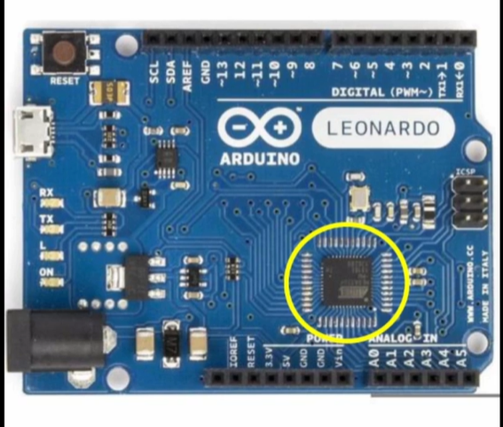
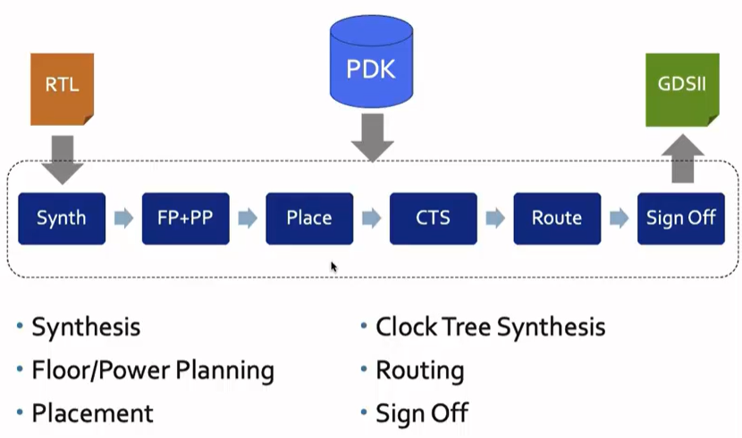
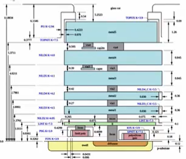

# <u> Day 1 - Inception of open-source EDA, OpenLANE and Sky130 PDK </u>

## 1. Arduino Board
       
 +  

 - This is an arduino microcontroller board. The encircled area shows the chip(microprocessor) which is interfaced with other components of the board. The designing of this chip from abstract level all the way down to the fabrication is done by RTL to GDSll flow. 

## 2. Block diagram of a SoC(System on Chip)

  +      
     
This is the basic block diagram of the processor or SoC. It gives us an abstract idea of the different components present in a chip.
It consists of the main processor , SDRAM chip(memory) , ADC (analog to digital converters) , GPIOs(general purpose Input Output registers), communicatioin protocols(like I2C,UART ) etc.

###  Chip is connected to the package with the help of bond wires:
  + 

## 3. How does a chip look like?
+ 
+ 

 - **Parts of a chip**:
     - **PADS** : The blue squares around the edge are called PADS. These docks have connection points that allow the chip to send and receive messages with the outside world. These pads are connected to the pins of package  chip via bond wires.

     - **CORE** :The center black area is the brain of the chip, known as the CORE. The various components in this core work together to perform all the tasks the chip is designed for. 

     - **IP** : Each IP(Intellectual Property) block has a specific function. Chip designers can take these pre-made blocks and snap them together to build the exact functionality they need for their chip. ex: ADC, DAC, PLL, etc.

     - **Macro** : These blocks are blocks which are pure digital logic.

## 4. What is a PDK?
   - PDK stands for Process Design Kit.
   - It is nothing but a collection of files which will be used for modelling the fabrication process for IC design.
   - It includes:
        + Process Design Rules : DRC , LVS , etc.
        + Digital standard cell libraries
        + Input Output libraries
        + and many more files
    
    
 ## 5. Simple RTL to GDSll flow
 +   

**Step 1. Synthesis** : This step converts a RTL design to a circuit by using . elements from a Standard Cell Library. The resultant circuit is called the Gate Level Netlist. Standard Cells have regular layouts and each Standard Cell has different views/models (like Electrical, HDL, SPICE)

 **Step 2. Floor/Power Planning** : In this step our aim is to create a plan area dimensions for different components in a chip and create a robust power distributuion network for chip components.
  +     
 In power planning, the chip is powered by multiple VDD and ground pins. The supply and ground pins are connected to all components using power straps and power rings. 

 **Step 3. Placement** : We need to place the cells of netlist on the sites. Placement must be such that the interconnect delay is minimum and to be able to get efficient routing. 

 **Step 4. Clock Tree Synthesis** : We need to create a clock distribution network which delivers clock to all the sequential elements in the circuit.
 The clock must have minimum skew.

 **Step 5. Routing** : This step involves implementing interconnects to connect various components in the circuit. There are a fixed number of metal layers on a wafer, so we need to develop vertical and horizontal patterns to route the interconnects through these metal layers. The metal layer specs are defined in the PDK. 
+ The routing grid is formed by meta tracks.
+ We use divide and conquer approach to implement it:
  + Global routing is used to generate routing guides.
  + Detailed routing is the used to implement the actual wiring.   
 

**Step 6. Sign Off** : 
+ Physical Verifications :
  + DRC(Design Rules Checking) makes sure that the final layout follows all the design rules.
  + LVS (Layout vs Schematic) is done to check whether the generated final layout performs similar function as the initial netlist that we started with.
+ Timing Verification :
   + STA(Static Timing Analysis) makes sure that all the timing constraints are met.

# Basic Linux Commands
    - cd <name_of_folder>     : opens the particular folder
    - ls                      : lists the content of the folder
    - pwd                     : shows the present working directory
    - mkdir                   : to make a new directory

   

