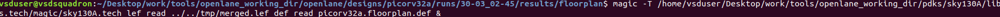

# <u>  Floorplanning And Introduction to library cells </u>

## 1. Defining the width and height of CORE and DIE :
  - The width and height help us to analyse the terms like utilization factor and aspect ratio.
  - **Utilization Factor** = *Area Occupied by the Netlist* / *Total Area of the Core*
  - **Aspect Ratio** = *Height* / *Width*
  -  Ex:   Netlist occupies an area of 4 sq units  

       -  
      
      - Core has a total area of 8 sq units

        - 

      - Utilization factor = 4/8 = 0.5
      - Aspect Ratio of core = 2/4 = 0.5    

## 2. Concept of preplaced cells:
  - If some portion of a netlist is repeating many times in the circuit then we can create separate block for this netlist and place it on floor before placement and routing process. These are called as pre-placed cells. We can not modify the positions of these blocks.
  - Examples of pre-placed cells are : MUX, Memory, Clock-gating cell,etc.
    - Ex: 


## 3. Need for Decoupling Capacitors:
   - 

   - Due to the voltage drop occuring across the wire, the voltage across the circuit may not be sufficient to provide peak current required during switching. 
   -This may cause the output voltage of the circuit to be in an undefined state(voltage may lie in the undefined region of voltage-transfer-characteristics plot).
   - So, we can use a __Decoupling Capacitor__ put across the circuit so that this capacitor can be charged upto the voltage supply potential.
   - This helps the circuit to get the peak current while switching with proper output voltages to be recognized as logic 1 or logic 0.
    -   


   - These decoupling capacitors are used to surround the pre-placed cells to avoid any problems.


       -   

## 4. Need for Power Planning:
  
  - Ex : A 16-bit Bus is connected to an inverter
    -  
    - **Ground Bounce:**
      - 
    - **Voltage Droop**
      - 
        
   - The voltage Droop and Ground Bounce problems will occur when we are using a single voltage source for more number of cells due to which this single supply source is not able to supply enough charge.

   **We can solve this by using multiple power supply lines (known as MESH) as shown in figure below:**  
      - 

   **Mesh**   :   

## 5. Pin placement and logical cell placement blockage

   - Consider an example of the following circuit:
      - 

      - The input, output and clock pins are to be created on the chip to be able to be interfaced with external packages.

   - We place various pins on the  empty area near the edges of the die. 
   - The position of pins should facilitate the routing process.
   - The clock pins are wider than the i/o pins to provide minimum resistance path so that this clock signal can be transferred as fast as possible because these clock pins drive all the blocks on core continuously.
   -  

   - **Logical Cell Placement Blockage** :
         We need to do this so that the automated placement and routing tools does not place cells in the area of pins. 

        -   

## 6. LAB: 
   -  
   - The README.md file in the above shown location contains all the information related to the processes flow parameters.
     - 
     - Each parameter can be termed as a switch whose value can be modified during the process flow but not in this file.

     

  - The __floorplan.tcl__ file in the __configuration__ folder contains the system default values for the parameters. This file has the lowest priority.
       -  

    -  
       After that the priority is for __config.tcl__ file in the following location:

         
    
    - And then the highest priority is for __sky130A_sky130_fd_hd_sc_config.tcl__ file in the above shown location.

    - we then run the __run_floorplan__ command exactly where we were left with the __synthesis_succesful__ message.
    -  

    - To view the results of the completed floorplan we go to the following location
       -   

     - The __def__(design exchange format) file contains all the floorplan info after doing the floorplan process.
        - 

     - In this  def file we can observe : 
       UNITS DISTANCE MICRONS 1000 : Database units per micron
       DIEAREA (X0,Y0) (Xf,Yf) : shows the dimensions.
      
      - so we need to divide these dimensions by 1000 to get the size in microns  (i.e.micrometers)
      -  Xf = 660685/1000 = 660.685 um
      -  Yf = 671405/1000 = 671.405 um
      - Die Area = Xf * Yf = 443587.212 (um)^2

  - Since we can not read everything from a def file, we will use __magic__ tool to visually look at the floorplan. Execute the following command to run magic:
    - 
   - 

     - 
     - This is the view of floorplan in the magic tool.
     - We can make the following observations in this tool :
       - As seen in the config.tcl file, horizontal pins are on __metal layer3__ :
       - 
       - Vertical pins are on __metal layer2__ :
       - 
     

     - We can see the tapcells present on the floor which avoid the latchup occuring in the CMOS by connecting N-well to Vdd and substrate to the ground. :  

     - There are standard cells present on the floor:
         - 


  ### Netlist Binding and Physical Cells:

   - **Library** : It consists info about various types of cells, their shapes, sizes and delays. We can have same logic function being performed by cells of different shapes and delays .
   - Ex : 
     
   - **Placement** : By considering the physical shapes of cells from library, we need to place the cells on the floor efficiently.
     - 

     - We need to optimize the placement and also use __repeaters__(buffers)so that the cells which are placed far from the pin ports can get correct logic signal which can get deteriorated due to longer wire losses.
      - Ex: 
    
    - The wires of different blocks gettin crossed will be routed through different layers. 
  
  - **Placement** : 
    - Placement  occurs in two stages : **Global** and **Detailed** and there are different tools to perform these.
    - __Global Placement__ :
       - Focuses on coarse placement and there are no legalizations happening here which means that there may be some overlaps of cell areas happening here.
       - Main aim is to reduce wire length (known as Half Parameter Wire Length i.e. HPWL in OPENLANE). 
       
    - __Detailed Placement__ :
      - This is done to solve the legalization problem after global placement.    

    -  we use the ``` run_placement ``` command to run.

     - 
    

    - Then we will run the following command to view the placement in magic tool :
      - 

      - we can observe the placement of standard cells as follows:
       - 