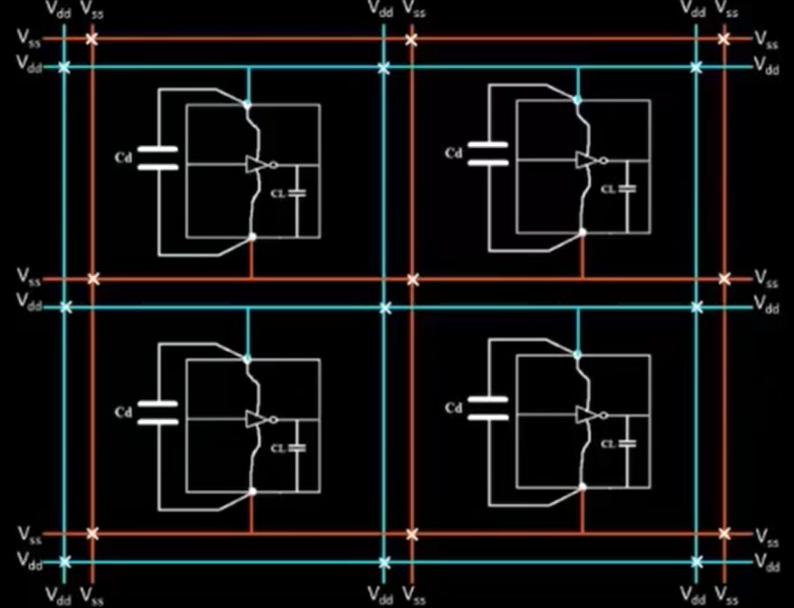

# <u>  Floorplanning And Introduction to library cells </u>

## 1. Defining the width and height of CORE and DIE :
  - The width and height help us to analyse the terms like utilization factor and aspect ratio.
  - **Utilization Factor** = *Area Occupied by the Netlist* / *Total Area of the Core*
  - **Aspect Ratio** = *Height* / *Width*
  -  Ex:   Netlist occupies an area of 4 sq units  

       -  
      
      - Core has a total area of 8 sq units

        - 

      - Utilization factor = 4/8 = 0.5
      - Aspect Ratio of core = 2/4 = 0.5    

## 2. Concept of preplaced cells:
  - If some portion of a netlist is repeating many times in the circuit then we can create separate block for this netlist and place it on floor before placement and routing process. These are called as pre-placed cells. We can not modify the positions of these blocks.
  - Examples of pre-placed cells are : MUX, Memory, Clock-gating cell,etc.
    - Ex: 

## 3. Need for Decoupling Capacitors:
   - 

   - Due to the voltage drop occuring across the wire, the voltage across the circuit may not be sufficient to provide peak current required during switching. 
   -This may cause the output voltage of the circuit to be in an undefined state(voltage may lie in the undefined region of voltage-transfer-characteristics plot).
   - So, we can use a __Decoupling Capacitor__ put across the circuit so that this capacitor can be charged upto the voltage supply potential.
   - This helps the circuit to get the peak current while switching with proper output voltages to be recognized as logic 1 or logic 0.
    -   

   - These decoupling capacitors are used to surround the pre-placed cells to avoid any problems.

       -   

## 4. Need for Power Planning:
  
  - Ex : A 16-bit Bus is connected to an inverter
    -  
    - **Ground Bounce:**
      - 
    - **Voltage Droop**
      - 
   - The voltage Droop and Ground Bounce problems will occur when we are using a single voltage source for more number of cells due to which this single supply source is not able to supply enough charge.

   **We can solve this by using multiple power supply lines (known as MESH) as shown in figure below:**  
      - 

   **Mesh**   :   

## 5. Pin placement and logical cell placement blockage

   - Consider an example of the following circuit:
      - 

      - The input, output and clock pins are to be created on the chip to be able to be interfaced with external packages.

   - We place various pins on the  empty area near the edges of the die. 
   - The position of pins should facilitate the routing process.
   - The clock pins are wider than the i/o pins to provide minimum resistance path so that this clock signal can be transferred as fast as possible because these clock pins drive all the blocks on core continuously.
   -  

   - **Logical Cell Placement Blockage** :
         We need to do this so that the automated placement and routing tools does not place cells in the area of pins. 

        -   

