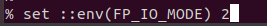
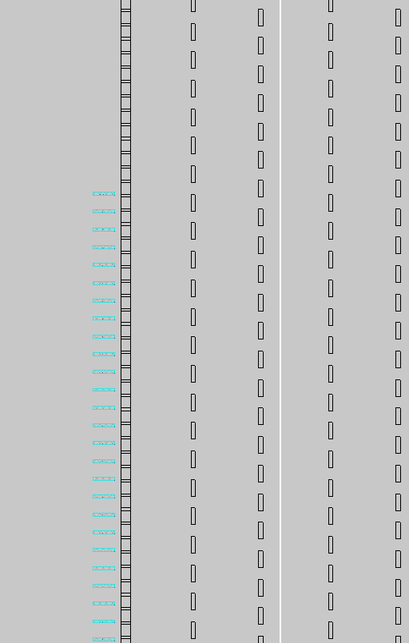
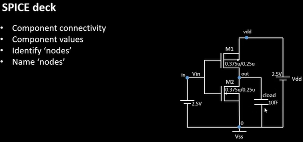
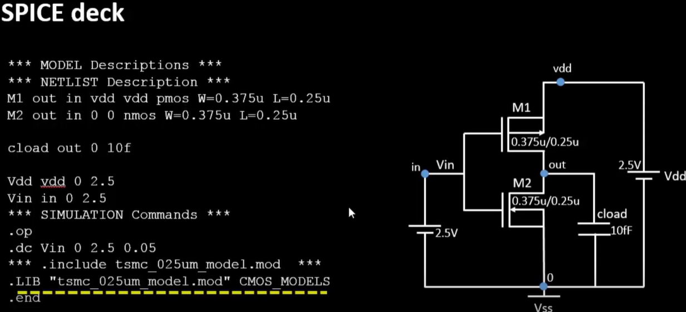

# Day 3


## **Can we change the parameters of floorplan?**
==> YES.
- Let us try to change the distance between pins in the floorplan process. Since, changing the values is allowed in OPENLANE process flow.
- We need to copy the parameter name from the config.tcl file in the floorplan folder inside results whose value is to be changed.
- We then paste this command prefixed with __set__ word in the terminal window where we had run the run_floorplan command.


   -   
 - In this command we changed the distance between the input pins and output pins on the floor which were placed equidistant earlier. 

- Then execute the __run_floorplan__ command again to proceed with the changed parameter.
-  Then again we need to run the invoke the magic tool as done earlier.
   - 
   - we observe that the pins are now not equidistant.

# SPICE Deck:
     

 - 

 - We can write the SPICE Deck as follows :

    - 
    - The lines with stars are the comments.
    - The connections related to the PMOS and NMOS are give in a specific order as :
      - __mosname__ - __drain__ - __gate__ - __substrate__ - __source__ - __W__ - __L__.

    - The connections for other elements are given in the order :
        - __elementname__ - __uppernode__ - __lowernode__ - __value__

    - Some examples of spice simulation commands are shown in the above image.

# Cloning Git Repo for Standard cell of Inverter :


   -  
   - We cloned the inverter in __openlane__ directory by using the command :

     
     -   ```  git clone https://github.com/nickson-jose/vsdstdcelldesign.git  ```
     
   -  We copied the __sky130A.tech__ file from */home/vsduser/Desktop/work/tools/openlane_working_dir/pdks/sky130A/libs.tech*  into the cloned *vsdstdcell* directory.

   - We then execute the following command to see the inverter in *magic* . 
       - 
       -  
                   
# CMOS Fabrication Process:

**1. Selection of substrate :**
   
   - 
  


**2. Active Region Formation:**

   
   - This step is done to ensure isolation between NMOS and PMOS when both the NMOS and PMOS will be made in the same substrate.
   - 

**3. N-Well and P-Well Formation :**

   - In this step, the NMOS is formed by masking the PMOS region and then ion implanting the donor atoms(Phosphorous) of required dose in the NMOS region.
   - Similarly, the PMOS region is formed by masking the NMOS region and then ion implanting the acceptor atoms(Boron) of required dose in PMOS region.
   - Then the substrate is placed in a high temperature furnace so that the doped atoms can diffuse into the silicon.
   - 

**4. Formation of Gate:**

   - 

**5. LDD Formation(Lightly Doped Drain) :**

   - This step is done to address the problem of *Hot electron* and *Short Channel Effects*.
   - Hot electron problem occurs when a large electric field due to large supply voltage is induced across a small channel MOSFET.
   - Short Channel effects occur when in MOSFETs having channel length lower than 1um. Due to which the channel length is comparable to the depletion regions present on drain-substrate interface. So, the drain voltage tries to influence the current in channel region.
   - 

**6. Source and Drain Formation:**

   - 

 **7. Formation of Contacts and Local Interconnects:**

   - 

 **8. Higher Layer Metal Formation:** 

   - 


## SPICE Extraction :

 - To know the logical functions of the inverter, we will first extract the spice and then we will do the simulatiions in ngspice.
 - **Extracting SPICE**:
     - we will execute the following command in the *tkcon* window of magic tool :
           - ``` extract all ```
     - 
     - This will create an **sky130_inv.ext** file in the *vsdstdcelldesign* directory.
     - Then we will use this **sky130_inv.ext** file to create a SPICE file to be used in *ngspice* tool by executing the following command in the *tkcon* window of magic tool:
     -   ``` ext2spice cthresh 0 rthresh 0 ```                       <br>
     -   ```  ext2spice ```
                                             
     - *ctresh 0 rthresh 0* in above command will extract all the parasitic capacitaces also.
        - 
        - we are now able to see these files in the *vsdstdcelldesign* directory.
        - 

     - We can use **vim** editor in linux to view the content of spice file by running the following command in the terminal:
         -  ``` vim sky130_inv.spice ```
         - 
         - The __.option scale__ specifies the dimensions of the grid box in layout.
         - We will edit this file to  make the required changes and set values of voltage sources and include the *transient* analysis commands.
         - To edit this file in vim editor :
              - Open this file in vim editor in terminal.
              - Press "I" to invoke the "Insert" mode for editing.
              - make the required changes.
              - Press __Esc__ and then type  ``` :wq ``` to save and exit.
              - 

         - Then we will run the command
                    ```  ngspice sky130_inv.spice ```
           to invoke the ngspice tool.
           - 
           - 


              


 


    
